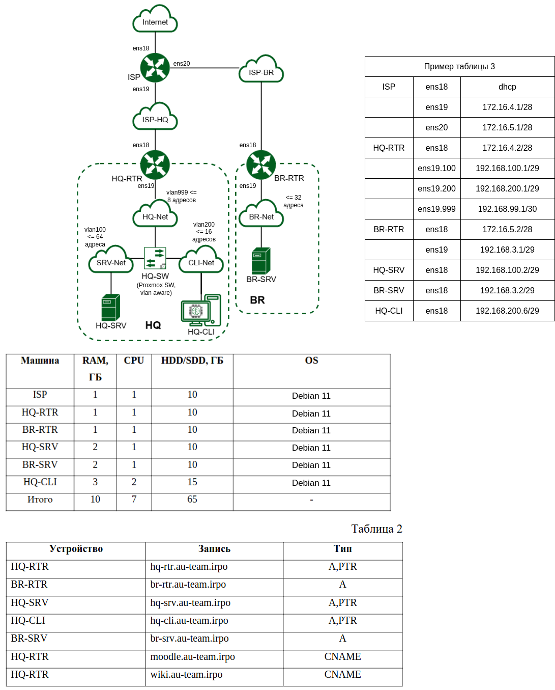
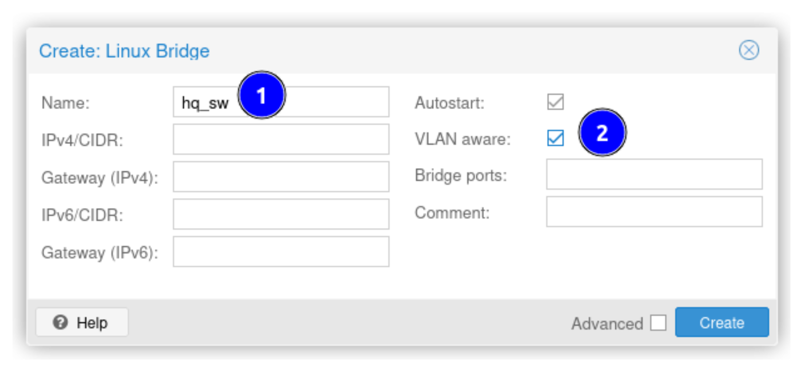
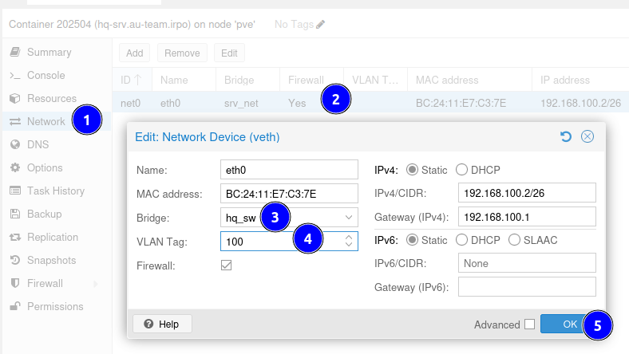
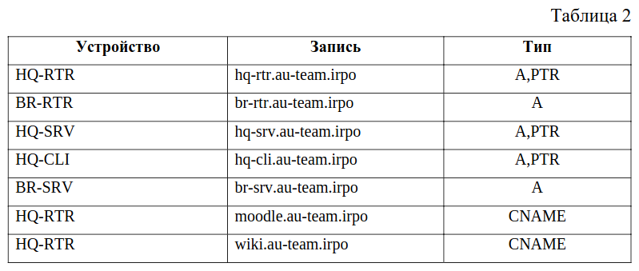

!!! warning "Пользоваться данным сайтом на самом демонстрационном экзамене, вероятно, нельзя. Уточняйте у своей группы экспертов."

[📁 Задание](files/задание.pdf) (обрезанный файл, взят с оф. сайта)

[📁 Приложение](files/приложения.zip) (потенциальное, взят с оф. сайта)


## Введение

Здесь рассматривается один из вариантов решения демоэкзамена [Код 09.02.06-1-2025](https://bom.firpo.ru/file/public/75435/%D0%9A%D0%9E%D0%94%2009.02.06-1-2025%20%D0%A2%D0%BE%D0%BC%201.pdf), базовый уровень (**только модули 1 и 2**).

-   **Разные стенды:** В модулях используются разные стенды. Сначала будет выдан доступ к стенду модуля 1, а далее по запросу сдающего будет выдан доступ к стенду модуля 2, при этом доступ к стенду модуля 1 будет закрыт.

-   🌐 **Доступ в Интернет:** Как правило, доступ есть, но нельзя нигде логиниться, общаться на форумах, пользоваться мессенджерами и нейросетями. Запросы в поисковой системе должны быть общими, без конкретизации адресов, доменных имен и т.п. Нельзя вводить конкретный URL.

-   **Не заучивайте настройки:** На самом ДЭ задание может немного отличаться, поэтому не следует заучивать конфигурации и команды - нужно понимать принципы настройки.

-   ⚠️ **Перезагрузка стенда:** После завершения выполнения задания, вам будет необходимо перезагрузить весь стенд. Перезагружать машины можно в том порядке, в каком считаете нужным. Работоспособность решения не должна при этом нарушиться. После окончания нельзя будет вносить какие-либо изменения.

-   **Это не идеальное решение:** Некоторые приведенные команды могут показаться избыточными. Это сделано намеренно, чтобы указать набор используемых команд. При этом нужно понимать, что делать каждая команда и применять только те, которые необходимы в данный момент.

-   **Анализируйте копируемые команды:** Будьте аккуратны при выполнении команд, содержащих `cat << EOF > ...`, т.к. можно затереть уже имеющиеся настройки. Лучше вручную открывать файл и "копипастом" вставлять текст или вводить вручную.

-   **Снапшоты:** При возможности рекомендуется использовать.


## Модуль 1

### Немного о стенде

-   Все виртуальные машины (VM) созданы путем клонирования.
-   Все VM на стенде - Debian 11.11.
-   Стенд не преднастроен.
-   Часть пакетов предзагружена, но не установлена.
-   На VM преднастроен прокси для загрузки пакетов, чтобы ускорить их загрузку и случайно не получить бан по IP из-за массовой одновременной загрузки. Ознакомиться [здесь](https://wiki.debian.org/AptCacherNg).
-   На клиентской машине нужно включить автозапуск графического окружения. По умолчанию на всех VM графическое окружение не запускается.

    ```
    cat << EOF >> ~/.xinitrc
    ...
    EOF
    ```

-   **Удобный "копипаст":** Чтобы можно было использовать копипаст, рекомендуется использовать консоль `xterm.js`. Расположение: возле кнопки запуска и остановки VM есть кнопка `Console`, в выпадающем списке есть вариант `xterm.js`. Работает через контекстное меню.

-   Для доступа VM в 🌐 **Интернет** (при необходимости) есть два варианта:

    -   ✅ **Рекомендуемый:** Настраивать постепенно схему, начиная с ISP, настраивая NAT и маршрутизацию и прочее. По сути выполнять задание, возможно, не в том порядке, котором идут задания. Так вы сразу будете уверены, рабочие настройки или нет.

    -   ❌ **Не рекомендуемый:** Подключить VM к бриджу (например, `vmbr0`) с доступом в Интернет, но потом не **забыть отключить**. Способ простой, быстрый, но при этом могут быть неочевидные конфликты конфигураций с заданием.

-   **Маршрутизация:** На всех маршрутизаторах необходимо включить пересылку пакетов. Далее об этом не упоминается.

    ```
    echo "net.ipv4.ip_forward=1" >> /etc/sysctl.conf
    sysctl -p
    ```

-   **Интерфейсы и адресация:** На рисунке ниже приведены названия интерфейсов и их адреса. Названия интерфейсов на стенде будут по возможности такими же. Адресация может отличаться, если изменится задание. Будьте внимательны.

-   ⚠️ **Важно!** Лучше придерживаться всем одной адресации, путей и прочих параметров, не зафиксированных заданием, чтобы во время подготовки можно было легче найти ошибки, а во время проверки на ДЭ - облегчить жизнь проверяющим. Никто не будет искать то, что лежит в нестандартном месте.

-   **Характеристики VM:** По умолчанию выставлены необходимые характеристики, но лучше их проверить и изменить при необходимости.



Далее приведено **примерное** решение заданий и не во всех случаях приведенных конфигураций достаточно.


### 1. Произведите базовую настройку устройств

> Настройте имена устройств согласно топологии. Используйте полное доменное имя.

```
isp.au-team.irpo
hq-rtr.au-team.irpo
br-rtr.au-team.irpo
hq-srv.au-team.irpo
hq-cli.au-team.irpo
br-srv.au-team.irpo
```

```
hostnamectl set-hostname isp.au-team.irpo
```

*Проверка:*

```
hostnamectl status
logout
login
hostnamectl status
```


> Локальная сеть в сторону HQ-SRV (VLAN100) должна вмещать ❗ **не более** 64 адресов.

Например, `192.168.100.0/29 (255.255.255.248)`.

8 адресов, 6 - для узлов, этого достаточно для задания.


> Локальная сеть в сторону HQ-CLI (VLAN200) должна вмещать ❗ **не более** 16 адресов.

Например, `192.168.200.0/29 (255.255.255.248)`.

8 адресов, 6 - для хостов, этого достаточно для задания.


> Локальная сеть для управления (VLAN999) должна вмещать ❗ **не более** 8 адресов.

Например, `192.168.99.0/30 (255.255.255.252)`.

4 адреса, 2 - для хостов, этого достаточно для задания.


> Локальная сеть в сторону BR-SRV должна вмещать ❗ **не более** 32 адресов.

Например, `192.168.3.0/29 (255.255.255.248)`.

8 адресов, 6 - для хостов, этого достаточно для задания.


> Сведения об адресах занесите в отчёт, в качестве примера используйте Таблицу 3.

Примером таблицы, вероятно, является таблица из Приложения Б, но лучше ❗ **спросить** на самом экзамене у проверяющих.


### 2. Настройка ISP

> Интерфейс, подключенный к магистральному провайдеру, получает адрес по DHCP.

```
# /etc/network/interfaces
auto ens18
iface ens18 inet dhcp

systemctl restart networking.service
dhclient
```


> Настройте маршруты по умолчанию там, где это необходимо.

По идее маршрут по умолчанию должен быть автоматически создан после получения адреса по DHCP.

```
ip route replace default via 192.168.0.1
```

??? example "Проверка"

    ```
    ip route show
    ip ro
    ```


> Интерфейс, к которому подключен HQ-RTR, подключен к сети `172.16.4.0/28`.

```
# /etc/network/interfaces
auto ens19
iface ens19 inet static
    address 172.16.4.1/28
```


> Интерфейс, к которому подключен BR-RTR, подключен к сети `172.16.5.0/28`.

```
# /etc/network/interfaces
auto ens20
iface ens20 inet static
    address 172.16.5.1/28
```


> На ISP настройте динамическую сетевую трансляцию в сторону HQ-RTR и BR-RTR для доступа к сети Интернет.

```
# /etc/network/interfaces
# или iptables, iptables-save
auto ens18
iface ens18 inet dhcp
    post-up iptables -t nat -I POSTROUTING -o ens18 -j MASQUERADE
    post-down iptables -t nat -F
```

!!! example "Проверка: маршрутизаторы должны пинговать адреса в Интернете."


### 3.  Создание локальных учетных записей

> Создайте пользователя sshuser на серверах ❗ **HQ-SRV и BR-SRV**. Пароль пользователя sshuser с паролем P@ssw0rd. Идентификатор пользователя 1010. Пользователь sshuser должен иметь возможность запускать sudo без дополнительной аутентификации.

```
useradd -u 1010 -m -s /bin/bash sshuser
echo sshuser:P@ssw0rd | chpasswd
```

`passwd` - изменить пароль.

Свою запись можно создать в отдельном файле.

```
# visudo /etc/sudoers.d/sshuser
# visudo /etc/sudoers
sshuser ALL=(ALL) NOPASSWD: ALL
```

??? example "Проверка"

    Войти под созданным пользователем и проверить права.

    ```
    su - sshuser
    sudo -v
    sudo nano /etc/hosts
    sudo apt update
    # или другие команды требующие повышение привилегий
    ```


> Создайте пользователя net_admin на маршрутизаторах ❗ **HQ-RTR и BR-RTR**. Пароль пользователя net_admin с паролем ❗**P@$$word**. При настройке ОС на базе Linux, запускать sudo без дополнительной аутентификации.

Решается по аналогии с прошлым заданием.

```
useradd -m -s /bin/bash net_admin
echo net_admin:P@$$word | chpasswd
echo "net_admin ALL=(ALL) NOPASSWD: ALL" >> /etc/sudoers.d/net_admin
```

**Обязательно проверить** по аналогии с прошлым заданием.


### 4. Настройте на интерфейсе HQ-RTR в сторону офиса HQ виртуальный коммутатор (⚠️ **принцип router-on-a-stick**)

Вероятно, данные преднастройки уже будут выполнены. Обязательно нажать после создания на `Apply Configuration`.




> Сервер HQ-SRV должен находиться в ID VLAN 100.

Подключить VM к bridge и назначить vlan.




> Клиент HQ-CLI в ID VLAN 200.

По аналогии к HQ-SW подключить HQ-CLI.


> Создайте подсеть управления с ID VLAN 999.

К HQ-SW подключить HQ-RTR, но ❗ **тег не указывать**, т.к. это будет транк.


### 5. Настройка безопасного удаленного доступа на серверах ❗ HQ-SRV и BR-SRV

> Для подключения используйте порт 2024. Разрешите подключения только пользователю sshuser. Ограничьте количество попыток входа до двух. Настройте баннер "Authorized access only".

```
cat << EOF > /etc/ssh/banner.txt
Authorized access only
EOF

cat << EOF > /etc/ssh/sshd_config.d/demo.conf
Port 2024
AllowUsers sshuser
MaxAuthTries 2
Banner /etc/ssh/banner.txt
EOF

systemctl restart sshd.service
```

??? example "Проверка"
    
    Проверить ввод неправильного пароля 2 раза, т.к. ограничение равно 2. Можно также создать тестового пользователя, которому не разрешено подключение. Потом удалить его, или не удалять, если это не противоречит заданию.

    ```
    ssh -p 2024 sshuser@localhost
    Authorized access only
    sshuser@localhost's password:

    useradd test
    passwd test 
    New password: test
    Retype new password: test
    passwd: password updated successfully

    ssh -p 2024 test@localhost
    Authorized access only
    test@localhost's password: test
    Permission denied, please try again.
    test@localhost's password: test
    Received disconnect from ::1 port 2024:2: Too many authentication failures
    Disconnected from ::1 port 2024

    root@hq-srv:~# userdel test
    ```


### 6. Между офисами HQ и BR необходимо сконфигурировать IT-туннель

Сеть для туннельных интерфейсов, например, такая - `192.168.255.0/30`. Внести эту информацию в отчет!

=== "HQ-RTR"
    
    ```
    ip tunnel add gre1 mode gre remote 172.16.5.2 local 172.16.4.2 ttl 64  dev ens18
    ip link set ens18 up
    ip addr add 192.168.255.1/30 dev gre1
    ```

=== "BR-RTR"
   
    ```
    ip tunnel add gre1 mode gre remote 172.16.4.2 local 172.16.5.2 ttl 64  dev ens18
    ip link set ens18 up
    ip addr add 192.168.255.2/30 dev gre1
    ```


### 7. Обеспечьте динамическую маршрутизацию

Неявные параметры:

-   area 0,
-   настраивать только на HQ-RTR и BR-RTR,
-   использовать пакет frr,
-   защита с помощью MD5,
-   пассивные интерфейсы все, кроме туннельных.

```
# /etc/frr/daemons
ospfd=yes

systemctl restart frr.service
```

Далее с помощью `vtysh` настроить OSPF. Сохранить конфигурацию. Должно быть похоже на следующее:

=== "BR-RTR"

    ```
    # /etc/frr/frr.conf
    !
    interface gre1
    ip ospf authentication message-digest
    ip ospf message-digest-key 1 md5 P@ssw0rd
    ip ospf network point-to-point
    !
    router ospf
    passive-interface default
    no passive-interface gre1
    network 192.168.3.0/29 area 0
    network 192.168.255.0/30 area 0
    area 0 authentication message-digest
    !
    ```

=== "HQ-RTR"

    ```
    # /etc/frr/frr.conf
    !
    interface gre1
    ip ospf authentication message-digest
    ip ospf message-digest-key 1 md5 P@ssw0rd
    ip ospf network point-to-point
    !
    router ospf
    passive-interface default
    no passive-interface gre1
    network 192.168.100.0/29 area 0
    network 192.168.200.0/29 area 0
    network 192.168.99.0/30 area 0
    network 192.168.255.0/30 area 0
    area 0 authentication message-digest
    !
    ```

??? example "Проверка"

    ```
    root@br-srv:~# traceroute 192.168.100.2
    traceroute to 192.168.100.2 (192.168.100.2), 30 hops max, 60 byte packets
    1  192.168.3.1 (192.168.3.1)  0.435 ms  0.377 ms  0.405 ms
    2  192.168.255.1 (192.168.255.1)  1.521 ms  1.484 ms  1.450 ms
    3  192.168.100.2 (192.168.100.2)  1.883 ms  1.902 ms  1.813 ms
    ```


### 8. Настройка динамической трансляции адресов

По аналогии с заданием 2 выполнить настройку правил на HQ-RTR и BR-RTR.


### 9. Настройка протокола динамической конфигурации хостов

Рекомендуемые параметры:

-   Настройте нужную подсеть - 192.168.200.0/29
-   Исключите из выдачи адрес маршрутизатора - 192.168.200.1/29
-   Адрес шлюза по умолчанию - адрес маршрутизатора HQ-RTR - 192.168.200.1/29
-   Адрес DNS-сервера для машины HQ-CLI - адрес сервера HQ-SRV - 192.168.100.2/29
-   DNS-суффикс для офисов HQ - au-team.irpo
-   Клиентом является машина HQ-CLI
-   Использовать dnsmasq


=== "HQ-RTR"

    ```
    # /etc/dnsmasq.conf
    domain=au-team.irpo
    interface=ens19.200
    dhcp-range=192.168.200.2,192.168.200.6,24h
    dhcp-option=1,255.255.255.248
    dhcp-option=3,192.168.200.1
    dhcp-option=6,192.168.100.2
    dhcp-host=<MAC-адрес HQ-CLI>,192.168.200.6

    systemctl restart dnsmasq
    ```

    Список опций DHCP можно изучить, например, [здесь](http://www.iana.org/assignments/bootp-dhcp-parameters/bootp-dhcp-parameters.xhtml).

=== "HQ-CLI"

    ```
    # /etc/network/interfaces
    auto ens18
    iface ens18 inet dhcp
    ```

??? example "Проверка"

    === "HQ-CLI"

        ```
        dhclient
        ip a
        ```

    === "HQ-RTR"

        ``` 
        cat /var/lib/misc/dnsmasq.leases
        ```


### 10. Настройка DNS для офисов HQ и BR

-   Основной DNS-сервер реализован на HQ-SRV
-   Сервер должен обеспечивать разрешение имён в сетевые адреса устройств и обратно в соответствии с таблицей 2
-   В качестве DNS сервера пересылки используйте любой общедоступный DNS сервер
-   https://www.zytrax.com/books/dns/ch8/soa.html
-   https://www.zytrax.com/books/dns/apa/time.html



Например, общедоступный DNS-сервер - `8.8.8.8`.

**HQ-SRV**

Параметры:

```
cat << EOF > /etc/bind/named.conf.options
options {
        directory "/var/cache/bind";
        allow-recursion { any; };
        forwarders { 8.8.8.8; };
        dnssec-validation auto;
        listen-on { 127.0.0.1; 192.168.100.2; };
};
EOF
```

Пречисление зон:

```
cat << EOF > /etc/bind/named.conf.local
zone "au-team.irpo" {
        type master;
        file "/etc/bind/db.au-team.irpo";
};

zone "168.192.in-addr.arpa" {
        type master;
        file "/etc/bind/db.168.192";
};
EOF
```

Описание прямой зоны:

```
$TTL    1d
$ORIGIN au-team.irpo.
@       IN      SOA     ns      admin (
        2025010100      ; Serial
        1h              ; Refresh
        1m              ; Retry
        1d              ; Expire
        1d              ; TTL
)
@       IN      NS      ns
ns      IN      A       192.168.100.2
hq-srv  IN      CNAME   ns
hq-rtr  IN      A       192.168.100.1
hq-rtr  IN      A       192.168.200.1
hq-rtr  IN      A       192.168.99.1
br-rtr  IN      A       192.168.3.1
hq-cli  IN      A       192.168.200.6
br-srv  IN      A       192.168.3.2
moodle  IN      CNAME   hq-rtr
wiki    IN      CNAME   hq-rtr
```

Описание обратной зоны:

```
TTL    2d
$ORIGIN 168.192.in-addr.arpa.
@       IN      SOA     ns.au-team.irpo admin.au-team.irpo. (
                        2025020820      ; Serial
                        1d              ; Refresh
                        1h              ; Retry
                        1d              ; Expire
                        1d )            ; Negative Cache TTL
;
@       IN      NS      ns.au-team.irpo.
6.200   IN      PTR     hq-cli.au-team.irpo.
2.100   IN      PTR     hq-srv.au-team.irpo.
1.100   IN      PTR     hq-rtr.au-team.irpo.
1.200   IN      PTR     hq-rtr.au-team.irpo.
1.99    IN      PTR     hq-rtr.au-team.irpo.
```

Проверить и перезагрузить:

```
named-checkconf
named-checkzone au-team.irpo /etc/bind/db.au-team.irpo
named-checkzone 168.192.in-addr.arpa /etc/bind/db.168.192
systemctl restart bind9
```

!!! example "Проверка: на HQ-SRV и HQ-CLI использовать `nslookup` или `dig`."


### 11. Настройте часовой пояс на всех устройствах, согласно месту проведения экзамена

```
timedatectl set-timezone Europe/Moscow
```

??? example "Проверка"

    ```
    timedatectl status
    ...
    Time zone: Europe/Moscow (MSK, +0300)
    ...
    ```


## Модуль 2

**⚠️ Еще раз внимание:** Важно понимать, что модуль 2 выполняется не совместно с модулем 1. Это будут отдельные преднастроенные машины. Т.е. все, что вы настроили в модуле 1, никак не влияет на начало выполнения модуля 2. Доступ к стенду модуля 2 выдается по запросу, при этом доступ к стенду модуля 1 будет закрыт.


### 1. Настройте доменный контроллер Samba на машине BR-SRV

🚨 **Это одно из сложных заданий!** Рекомендуется пропустить и выполнять в последнюю очередь. Не факт, что потраченное время будет равносильно количеству полученных баллов.

⚠️ **Перед выполнением рекомендуется сделать снапшот, и после - тоже.**

👎 **Приведенное далее описание - плохой черновик.** По приведенным на оф. документацию ссылкам реально выполнить задание, но документация достаточно запутанная, учитывая, что она еще на английском. 

✅ **Если несколько раз прорешать, то все получится.**

Вспомогательные ссылки:

-   [Взаимоотношения dhcpclient и resolv.conf'а в Linux](https://habr.com/ru/articles/280037/)
-   [Samba AD](https://wiki.samba.org/index.php/Setting_up_Samba_as_an_Active_Directory_Domain_Controller)
-   [Настройка Kerberos-аутентификации](https://dev.rutoken.ru/pages/viewpage.action?pageId=3440679)
-   [samba-tool](https://man.freebsd.org/cgi/man.cgi?query=samba-tool&sektion=8&format=html)
-   [Sudoers Policies](https://dmulder.github.io/group-policy-book/sudoers.html)

**BR-SRV**

```
resolveconf --disable-updates
mv /etc/samba/smb.conf{,.backup}

smbd -b | egrep "LOCKDIR|STATEDIR|CACHEDIR|PRIVATE_DIR"

rm -rf /run/samba/*
rm -rf /var/lib/samba/*
rm -rf /var/cache/samba/*

# mkdir -p /var/cache/samba
# mkdir -p /var/lib/samba/private

cat << EOF > /etc/resolve.conf
search au-team.irpo
nameserver 127.0.0.1
EOF

samba-tool domain provision --server-role=dc --use-rfc2307 --dns-backend=SAMBA_INTERNAL --realm=AU-TEAM.IRPO --domain=AU-TEAM --adminpass=P@ssw0rd

systemctl start named

mv /etc/krb5.conf{,.backup}
cp /var/lib/samba/private/krb5.conf /etc/krb5.conf

testparm

samba

samba-tool dns zonecreate br-srv.au-team.irpo 3.168.192.in-addr.arpa -U Administrator

samba-tool dns add br-srv.au-team.irpo 3.168.192.in-addr.arpa 2 PTR br-srv.au-team.irpo -U Administrator

samba-tool group add hq
for i in {1..5}; do samba-tool user create user$i P@ssw0rd; done
for i in {1..5}; do samba-tool group addmembers hq user$i; done
```

⚠️ **Не описано, как настроить sudoers для домена. См. ссылки выше.**

**HQ-CLI**

Доп. ссылка: [Samba as a Domain Member](https://wiki.samba.org/index.php/Setting_up_Samba_as_a_Domain_Member)

```
net ads info
```

**Вход в систему под доменным пользователем**

Доп. ссылка: [Samba PAM](https://wiki.samba.org/index.php/Authenticating_Domain_Users_Using_PAM)


```
root@hq-cli:~# apt install libpam-winbind
root@hq-cli:~# find / -type f -name pam_winbind.so
/usr/lib/x86_64-linux-gnu/security/pam_winbind.so

# Не выполнять, если файл уже на месте!
root@hq-cli:~# ln -s /usr/local/samba/lib/security/pam_winbind.so /lib/x86_64-linux-gnu/security/
```

Далее должен работать su, ssh, login под доменным пользователем.

??? example "Проверка"

    ```
    samba-tool group list | grep hq
    samba-tool user list | grep user

    user@hq-cli:~$ kinit user1
    Password for user1@AU-TEAM.IRPO: 
    Warning: Your password will expire in 41 days on Wed 26 Mar 2025 10:25:14 PM MSK
    user@hq-cli:~$ klist 
    Ticket cache: FILE:/tmp/krb5cc_1000
    Default principal: user1@AU-TEAM.IRPO
    ```


### 2. Сконфигурируйте файловое хранилище

> При помощи трёх дополнительных дисков, размером 1 Гб каждый, на HQ-SRV сконфигурируйте дисковый массив уровня 5. Имя устройства – md0, конфигурация массива размещается в файле /etc/mdadm.conf. Обеспечьте автоматическое монтирование в папку /raid5. Создайте раздел, отформатируйте раздел, в качестве файловой системы используйте ext4.

Создать через веб-консоль еще 3 диска по 1 ГБ.

Убедиться, что диски есть и посмотреть их имена:

```
lsblk
```

Создать raid:

```
mdadm --create /dev/md0 --level=5 --raid-devices=3 /dev/sdb /dev/sdc /dev/sdd
```

Посмотреть информацию о raid:

```
root@hq-srv:~# mdadm --detail /dev/md0
/dev/md0:
...
        Raid Level : raid5
      Raid Devices : 3
              UUID : 9eee4466:2a562fe4:f0a4cea5:ab814e87
...
```

Сохранить конфигурацию в файл:

```
root@hq-srv:~# mdadm --detail --scan | tee /etc/mdadm/mdadm.conf 
ARRAY /dev/md0 metadata=1.2 name=hq-srv.au-team.irpo:0 UUID=9eee4466:2a562fe4:f0a4cea5:ab814e87

root@hq-srv:~# cat /etc/mdadm.conf 
ARRAY /dev/md0 metadata=1.2 name=hq-srv.au-team.irpo:0 UUID=9eee4466:2a562fe4:f0a4cea5:ab814e87

cp /etc/mdadm/mdadm.conf /etc/mdadm.conf
```

```
update-initramfs -u
```

Создание файловой системы:

```
mkfs.ext4 /dev/md0
```

Поиск UUID для fstab:

```
root@hq-srv:~# blkid
...
/dev/md0: UUID="fcbd9e71-1d2b-4c67-b2bb-36a53add0b91" BLOCK_SIZE="4096" TYPE="ext4"
...
```

```
echo "UUID=fcbd9e71-1d2b-4c67-b2bb-36a53add0b91 /raid ext4 defaults 0 0" >> /etc/fstab
```

```
root@hq-srv:~# mount -a
mount: /raid: mount point does not exist.
root@hq-srv:~# mkdir /raid
root@hq-srv:~# mount -a
root@hq-srv:~# ls /raid/
lost+found
root@hq-srv:~# df -h /raid/
Filesystem      Size  Used Avail Use% Mounted on
/dev/md0        2.0G   24K  1.9G   1% /raid
```

Удалить raid (не по заданию, а на всякий случай):

```
mdadm --stop /dev/md0
mdadm --zero-superblock /dev/md0
update-initramfs -u
# удалить из fstab
```


> Настройте сервер сетевой файловой системы(nfs), в качестве папки общего доступа выберите /raid5/nfs, доступ для чтения и записи для всей сети в сторону HQ-CLI.

**HQ-SRV**

```
mkdir /raid/nfs

echo "/raid/nfs 192.168.200.0/29(rw,sync,crossmnt,fsid=0,no_subtree_check,wdelay,all_squash)" >> /etc/exports

systemctl restart nfs-server.service
```


> На HQ-CLI настройте автомонтирование в папку /mnt/nfs.

**HQ-CLI**

```
mkdir /mnt/nfs
echo "192.168.100.2:/nfs /mnt/nfs nfs4 defaults 0 0" >> /etc/fstab
mount -a
```

??? example "Проверка"

    ```
    root@hq-srv:~# touch /raid/nfs/demo.txt

    root@hq-cli:~# ls /mnt/nfs/
    demo.txt
    ```


### 3. Настройте службу сетевого времени на базе сервиса chrony

Доп. ссылки: [chrony.conf](https://chrony-project.org/doc/4.0/chrony.conf.html), [pools](https://www.ntppool.org/zone/ru).

=== "Сервер"

    ```
    cat << EOF > /etc/chrony/conf.d/demo.conf
    #pool ru.pool.ntp.org iburst maxsources 3
    bindaddress 192.168.100.1
    local stratum 5
    allow all
    EOF

    systemctl restart chronyd

    chronyc sources -v
    chronyc tracking
    ```

=== "Клиент"

    /etc/chrony/chrony.conf

    ```
    server 192.168.100.1 iburst
    #pool 2.debian.pool.ntp.org iburst

    systemctl restart chronyd
    ```

??? example "Проверка"

    ```
    chronyc sources -v
    chronyc tracking
    ```

??? example "Еще вариант проверки"

    На сервере:

    ```
    timedatectl set-ntp false
    timedatectl set-time "2010-01-01 12:00:00"
    timedatectl set-ntp true
    systemctl restart chronyd
    ```

    На клиенте:

    ```
    systemctl restart chronyd
    chronyc sources -v
    chronyc tracking
    ```


### 4. Сконфигурируйте ansible на сервере BR-SRV

**Подготовка BR-SRV**

```
apt install python3-pip sshpass

pip install ansible-core
# или
python3 -m pip install ansible-core

ansible --version
```


> Сформируйте файл инвентаря, в инвентарь должны входить HQ-SRV, HQ-CLI, HQ-RTR и BR-RTR.

⚠️ **По умолчанию под рутом запрещено подключение по ssh.** Либо изменить права в sshd_config, либо создать пользователя, например sshuser, либо воспользоваться пользователем user, который по умолчанию есть.

```
cat << EOF > /etc/ansible/hosts
hq-srv.au-team.irpo ansible_port=2024 ansible_user=sshuser ansible_password=P@ssw0rd
hq-cli.au-team.irpo ansible_user=user ansible_password=user
hq-rtr.au-team.irpo ansible_user=user ansible_password=user
br-rtr.au-team.irpo ansible_user=user ansible_password=user
EOF
```

⚠️ **Если доступ устройств по DNS-именам не работает, укажите IP-адреса устройств.**


> Рабочий каталог ansible должен располагаться в /etc/ansible.

По умолчанию ansible может найти информацию оттуда. Возможно, потребуется создать эту директорию после установки ansible.

[https://docs.ansible.com/ansible/latest/reference_appendices/config.html](https://docs.ansible.com/ansible/latest/reference_appendices/config.html)


> Все указанные машины должны без предупреждений и ошибок отвечать pong на команду ping в ansible посланную с BR-SRV.
    
[https://docs.ansible.com/ansible/latest/reference_appendices/interpreter_discovery.html](https://docs.ansible.com/ansible/latest/reference_appendices/interpreter_discovery.html)

```
cat << EOF > /etc/ansible/ansible.cfg
[defaults]
interpreter_python = auto_silent
host_key_checking = False
EOF
```


> Все указанные машины должны без предупреждений и ошибок отвечать pong на команду ping в ansible посланную с BR-SRV.

```
root@br-srv:~# ansible all -m ping
hq-srv.au-team.irpo | SUCCESS => {
    "ansible_facts": {
        "discovered_interpreter_python": "/usr/bin/python3"
    },
    "changed": false,
    "ping": "pong"
}
hq-cli.au-team.irpo | SUCCESS => {
    "ansible_facts": {
        "discovered_interpreter_python": "/usr/bin/python3"
    },
    "changed": false,
    "ping": "pong"
}
hq-rtr.au-team.irpo | SUCCESS => {
    "ansible_facts": {
        "discovered_interpreter_python": "/usr/bin/python3"
    },
    "changed": false,
    "ping": "pong"
}
br-rtr.au-team.irpo | SUCCESS => {
    "ansible_facts": {
        "discovered_interpreter_python": "/usr/bin/python3"
    },
    "changed": false,
    "ping": "pong"
}
```


### 5. Развертывание приложений в Docker на сервере BR-SRV

[Установка Docker на Debain](https://docs.docker.com/engine/install/debian/)

```
apt-get install ca-certificates curl
install -m 0755 -d /etc/apt/keyrings
curl -fsSL https://download.docker.com/linux/debian/gpg -o /etc/apt/keyrings/docker.asc
chmod a+r /etc/apt/keyrings/docker.asc

echo \
  "deb [arch=$(dpkg --print-architecture) signed-by=/etc/apt/keyrings/docker.asc] https://download.docker.com/linux/debian \
  $(. /etc/os-release && echo "$VERSION_CODENAME") stable" | \
  sudo tee /etc/apt/sources.list.d/docker.list > /dev/null

apt-get update
apt-get install docker-ce docker-ce-cli containerd.io docker-buildx-plugin docker-compose-plugin

docker run hello-world
```

[Docker Compose файл для Media Wiki](https://www.mediawiki.org/wiki/Docker/Hub)

```
cat << EOF > ~/wiki.yml
services:
  mediawiki:
    container_name: wiki
    image: mediawiki
    restart: always
    ports: 
      - 8080:80
    depends_on:
      - database
    volumes:
      - images_volume:/var/www/html/images
      #- ./LocalSettings.php:/var/www/html/LocalSettings.php
  database:
    container_name: mariadb
    image: mariadb
    environment:
      MYSQL_DATABASE: mediawiki
      MYSQL_USER: wiki
      MYSQL_PASSWORD: WikiP@ssw0rd
      MYSQL_RANDOM_ROOT_PASSWORD: 'yes'
    volumes:
      - db_volume:/var/lib/mysql
volumes:
  db_volume:
  images_volume:
EOF
```

```
docker compose -f wiki.yml up -d
```

Пройти через этап установки. В качестве адреса БД использовать имя контейнера с БД - database. Будет скачан файл LocalSettings.php. Перенести его на BR-SRV любым доступным способом. Раскоментировать в wiki.yml volume для LocalSettings.php.

```
docker compose -f wiki.yml up -d
```

Открыть сайт по адресу 192.168.3.2. Готово.


### 6. На маршрутизаторах сконфигурируйте статическую трансляцию портов

> Пробросьте порт 80 в порт 8080 на BR-SRV на маршрутизаторе BR-RTR, для обеспечения работы сервиса wiki.

**BR-RTR**

```
iptables -t nat -A PREROUTING -p tcp -i ens18 --dport 80 -j DNAT --to-destination 192.168.3.2:8080
```

**BR-SRV**

В файле LocalSettings.php заменить адрес на 172.16.5.2 - параметр `$wgServer`.


> Пробросьте порт 2024 в порт 2024 на HQ-SRV на маршрутизаторе HQ-RTR.

```
iptables -t nat -A PREROUTING -p tcp -i ens18 --dport 2024 -j DNAT --to-destination 192.168.100.2:2024
```


> Пробросьте порт 2024 в порт 2024 на BR-SRV на маршрутизаторе BR-RTR.

```
iptables -t nat -A PREROUTING -p tcp -i ens18 --dport 2024 -j DNAT --to-destination 192.168.3.2:2024
```


### 7. Запустите сервис moodle на сервере HQ-SRV

Используйте Docker Compose по аналогии с MediaWiki.


### 8. Настройте веб-сервер nginx как обратный прокси-сервер на HQ-RTR

См. оф. документацию или [здесь](https://stackoverflow.com/questions/68196179/how-to-create-reverse-proxy-for-multiple-websites-in-nginx).


### 9. Удобным способом установите приложение Яндекс Браузере ⚠️ **для организаций** на HQ-CLI

Судя по информации на сайте браузера, там необходима регистрация. Можно спросить у проверяющих, устроит ли их вариант установки обычного Яндекс Браузера.

Научиться устанавливать обычный Яндекс Бразуер. Изучить, как потенциально устанавлиавать версию "для организаций".
